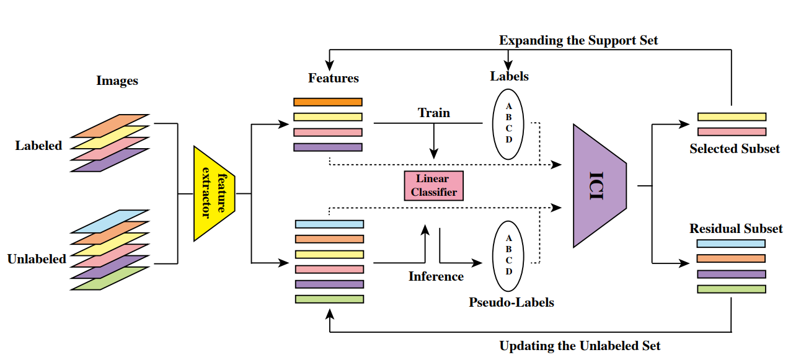
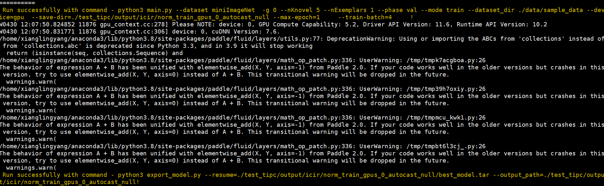
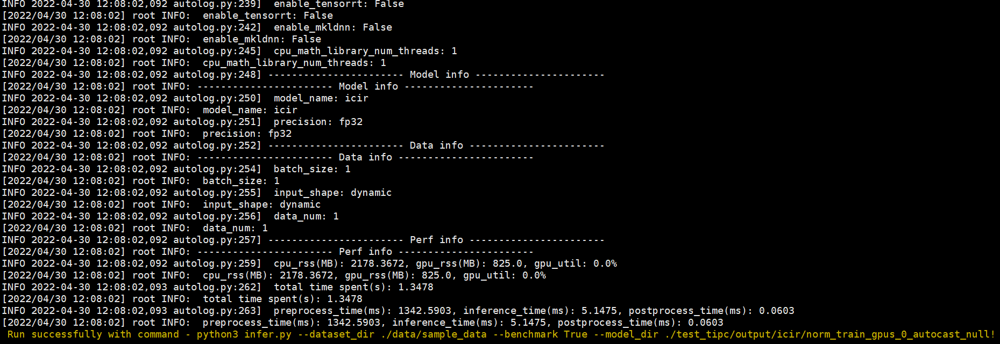

# How to Trust Unlabeled Data? Instance Credibility Inference for Few-Shot Learning

## 目录

- [1. 简介]()
- [2. 数据集和复现精度]()
- [3. 准备数据与环境]()
    - [3.1 准备环境]()
    - [3.2 准备数据]()
    - [3.3 准备模型]()
- [4. 开始使用]()
    - [4.1 模型训练]()
    - [4.2 模型评估]()
    - [4.3 模型预测]()
- [5. 模型推理部署]()
- [6. 自动化测试脚本]()
- [7. LICENSE]()
- [8. 参考链接与文献]()

## 1. 简介

​	   实例可信度推断模型聚焦如何将未标记样本更好加入到分类器的训练当中。其整体的模型见图，首先支持集中有标签标记样本集和未标记补充样本集经过一个预训练好的特征提取网络，得到各自对应的特征映射。其中含标签的样本将直接参与线性分类器的训练以得到一个初步的分类器模型，然后使用该分类器模型对未标记样本进行标签预测，得到对应的假标签 (pseudo label)。这些含假标签的样本集将通过实例可信度推断模块进行筛选，得到置信度高的假标签样本数据，并将这些数据添加到线性分类器模型的训练数据中再次训练分类器。以此不断往复训练、推断、添加，最终训练出一个拟合能力和泛化能力更强的线性分类器。最后，便可利用该训练好的分类器对询问集数据进行标签预测，完成小样本分类任务





**论文:** [How to Trust Unlabeled Data? Instance Credibility Inference for Few-Shot Learning](https://arxiv.org/pdf/2007.08461.pdf)

**参考repo:** [ICI-FSL](https://github.com/Yikai-Wang/ICI-FSL/tree/master/V2-TPAMI)

在此非常感谢 ICI-FSL repo的Yikai-Wang等人贡献的[ICI-FSL](https://github.com/Yikai-Wang/ICI-FSL/tree/master/V2-TPAMI) ，提高了本repo复现论文的效率。


## 2. 数据集和复现精度
**数据集:** [下载](https://pan.baidu.com/s/19vCAroRGoiO9OuOLRhGeNg?pwd=w491)

miniImageNet数据集节选自ImageNet数据集,包含100类共60000张彩色图片，其中每类有600个样本，每张图片的规格为84 × 84 。通常而言,这个数据集的训练集和测试集的类别划分为：80 : 20。
**复现精度:**

|  ICIR | 1shot  | 5shot  |
|---------|--------|--------|
| 论文      | 72.25% | 83.25% |
| 复现      | 72.44% | 83.38% |

权重和日志[下载](https://pan.baidu.com/s/19vCAroRGoiO9OuOLRhGeNg?pwd=w491) ，解压到模型目录下
## 3. 准备数据与环境


### 3.1 准备环境

首先介绍下支持的硬件和框架版本等环境的要求，格式如下：

- 硬件：GPU: Tesla V100 Mem 16GB, CPU 2cores RAM 16GB (aistudio高级GPU)
- 框架：
  - paddlepaddle-gpu==0.0.0.post102
- 使用如下命令安装依赖：

```bash
python -m pip install paddlepaddle-gpu==0.0.0.post102 -f https://www.paddlepaddle.org.cn/whl/linux/gpu/develop.html
pip install glmnet-py
## 安装AutoLog（规范化日志输出工具）
pip install git+https://github.com/LDOUBLEV/AutoLog
```

### 3.2 准备数据

数据解压到data目录下，少量测试数据sample_data已包含在本repo

```
# 全量数据： data/MiniImagenet
# 少量数据： data/sample_data
```

## 4. 开始使用

### 4.1 模型训练
#### 复现论文精度
```bash
# train 1 shot
python main.py --dataset miniImageNet --save-dir ckpt/miniImageNet/1-shot -g 0 --nKnovel 5 --nExemplars 1 --phase val --mode train
# train 5 shot
python main.py --dataset miniImageNet --save-dir ckpt/miniImageNet/5-shot -g 0 --nKnovel 5 --nExemplars 5 --phase val --mode train
```
```
Accuracy: 69.56%, std: :0.50%
==> Test 5-way Best accuracy 69.56%, achieved at epoch 81
```


### 4.2 模型评估
评估训练好的模型
```bash
python main.py --dataset miniImageNet --save-dir ckpt/miniImageNet/test -g 0 --nKnovel 5 --nExemplars 5 --phase test --mode test --resume ckpt/miniImageNet/5-shot/best_model.tar

python main.py --dataset miniImageNet --save-dir ckpt/miniImageNet/test -g 0 --nKnovel 5 --nExemplars 1 --phase test --mode test --resume ckpt/miniImageNet/1-shot/best_model.tar
```
评估结果
```
Load model from ckpt/miniImageNet/5-shot/best_model.tar
100% 2000/2000 [32:27<00:00,  1.03it/s] 
81.12 82.73 83.32 83.48 83.48
0.314 0.317 0.326 0.330 0.330
```

### 4.3 模型预测
单张图片预测

```bash
python main.py --dataset miniImageNet --save-dir ckpt/miniImageNet/test -g 0 --nKnovel 5 --nExemplars 5 --phase test --mode predict --resume ckpt/miniImageNet/1-shot/best_model.tar
# The predicted label is: 47, max_prob: 0.3150
```


## 5. 模型推理部署
###  模型导出
```bash
python3 export_model.py \
--resume ckpt/miniImageNet/1-shot/best_model.tar \
--output_path ckpt/miniImageNet/1-shot/
```
### 静态图推理
单张图片推理，输入同动态图
```bash
python3 infer.py --model_dir ckpt/miniImageNet/1-shot/
# The predicted label is: 47, max_prob: 0.3150
```


## 6. 自动化测试脚本

```shell
bash test_tipc/test_train_inference_python.sh test_tipc/configs/train_infer_python.txt  lite_train_lite_infer
```
关键步骤展示


## 7. LICENSE

本项目的发布受[Apache 2.0 license](./LICENSE)许可认证。

## 8. 参考链接与文献

[1] [How to Trust Unlabeled Data? Instance Credibility Inference for Few-Shot Learning](https://arxiv.org/pdf/2007.08461.pdf)

[2] [ICI-FSL](https://github.com/Yikai-Wang/ICI-FSL/tree/master/V2-TPAMI)

